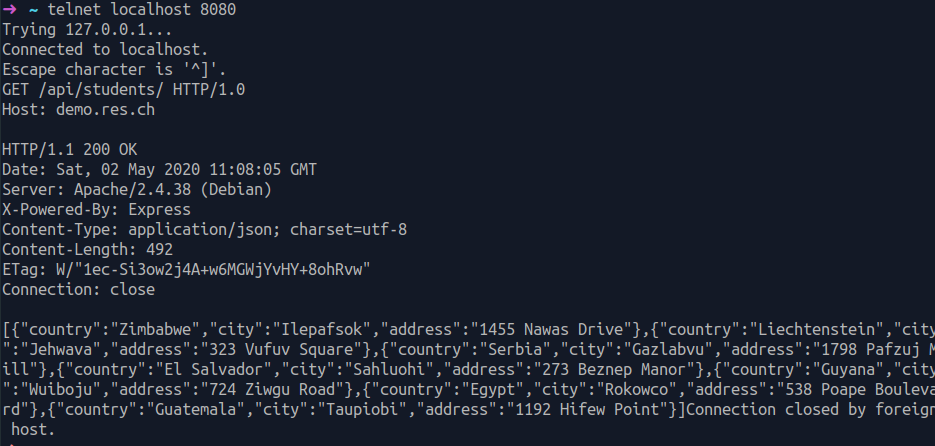
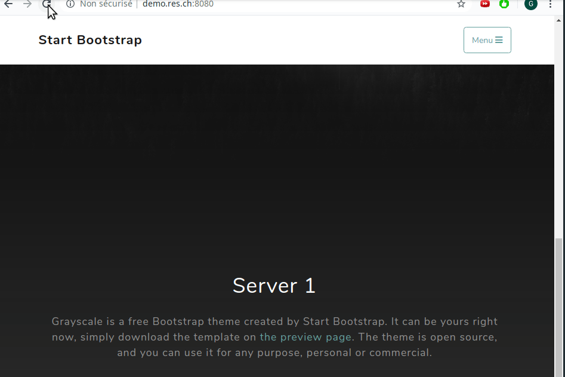

# RES - Labo HTTP Infra 

Auteur : Gaëtan Daubresse 

## Step 1 : Static HTTP server with apache httpd 

Cette étape consiste à configurer un serveur http statique à l’aide d’un Docker. Pour ce faire nous avons utilisé l’image officiel php disponible sur le site [dockerhub](https://hub.docker.com/). Elle a l’avantage de contenir un serveur apache déjà configuré pour servir des pages php. 

Nous avons ensuite écrit un [Dockerfile](./docker-images/apache-php-image/Dockerfile) permettant de pouvoir construire cette image docker. Dans ce fichier nous avons indiqué la version d’apache que nous souhaitions utilisé à l’aide de l’instruction `FROM php:7.2-apache` . Nous avons également installé vim afin de pouvoir éditer des fichier à l’intérieur du conteneur avec l’instruction `RUN apt-get update && apt-get install -y vim ` . Pour finir nous avons copié les fichiers de configurations à l’intérieur du docker avec l’instruction `COPY content/ /var/www/html/` . 

Nous avons avons obtenu des fichiers de configuration en téléchargeant un template [boostrap](https://startbootstrap.com/templates/) et copié son contenu à l’intérieur de notre dossier content. Nous avons ensuite modifié légèrement le fichier [index.html](.//docker-images/apache-php-image/content/index.html) afin qu’il corresponde à ce que nous voulions. Ceci permettra d’avoir une mise en page plus jolie. 

 Nous pouvons ensuite construire l’image depuis le dossier courant à l’aide de la commande `docker build -t res/apache_php . ` et démarrer un conteneur avec la commande `docker run -p 8080:80 res/apache_php` . 

## Step 2: Dynamic HTTP server with express.js

Cette étape consiste à écrire une application web node.js dynamique qui fournira des données de manière aléatoire.  

Nous avons comme pour l’étape précédente été chercher une image sur le site dockerhub et écrit un fichier [Dockerfile](./docker-images/express-image/Dockerfile) afin de pouvoir construire l’image. Nous copions les sources de notre programme à l’intérieur du docker dans le répertoire `/opt/app`. Nous ajoutons également l’instruction `CMD ["node", "/opt/app/index.js"]` qui permettra de lancer notre script au démarrage du docker. 

Pour réaliser notre programme node.js nous avons tout d’abord effectuer la commande `npm init` à l’intérieur de notre répertoire `/src`. Elle permet de créer un fichier package.json qui contient les informations relatives à l’application ainsi que les dépendances. 

Afin de générer des données aléatoire nous allons utilisé le module npm [chance.js](https://chancejs.com/). Pour enregistrer la dépendance à l’intérieur du fichier package.json nous utilisons la commande `npm install –save chance`.  

Nous avons ensuite édité le fichier [index.js](./docker-images/express-image/src/index.js) contenant le code de notre application. 

Pour la réalisation du code nous avons utilisé le framework [express.js](https://expressjs.com/fr/starter/hello-world.html)  afin de faciliter l’écriture du serveur http. Nous enregistrons donc comme précédemment la dépendance avec la commande suivante `npm install –save express`. 

Notre application va générer un tableau de localisation aléatoire de taille variable à chaque fois qu’une requête est effectuée sur le serveur.  Voici la méthode permettant la génération du tableau.  

Nous générons dans un premier temps un nombre aléatoire entre 0 et 10 qui correspondra au nombre d’élément dans le tableau. Si le nombre est supérieur à 0 nous itérons sur ce nombre pour remplir notre tableau à l’aide des fonctions fournies par le module chance. Nous retournons ensuite le tableau. 

```javascript
function generateLocations(){
	var numberOfLocations = chance.integer({
		min: 0, 
		max: 10
	}); 
	console.log(numberOfLocations); 
	var locations = []; 
	for(var i = 0; i < numberOfLocations; i++){
		locations.push({
			country: chance.country({ full: true }), 
			city: chance.city(),  
			address: chance.address()
		}); 
	}; 
	console.log(locations); 
	return locations; 
}
```

Après avoir construit l’image et démarré  notre conteneur nous pouvons tester l’application en envoyant manuellement une requête à l’aide de telnet. 



Nous observons que le serveur a compris notre requête et a pu y répondre sans problème (code de retour 200). Le tableau de localisation aléatoire nous est correctement retourné. 

## Step 3: Reverse proxy with apache (static configuration)

Cette étape nous permettra de centraliser les requêtes effectuées sûr les deux conteneurs statiques et dynamiques à l’aide d’un reverse proxy qui fonctionnera à l’intérieur d’un 3 eme conteneur. De cette manière toutes les requêtes se feront au travers du reverse proxy et nous éviterons ainsi d’être confronté au problème de same-origin-policy. Cette politique force la navigateur a n’exécuter uniquement les scripts provenant du même nom de domaine que la page HTML. 

Nous avons utilisé un [module](https://httpd.apache.org/docs/2.4/fr/mod/mod_proxy.html) du serveur apache permettant de réaliser le reverse-proxy. Il aurait cependant aussi été possible d’utiliser nginx ou une autre application. 

Afin de configurer le routage de manière correcte nous avons dû éditer le fichier [001-reverse-proxy.conf](./docker-images/apache-reverse-proxy/conf/sites-available/001-reverse-proxy.conf) qui que nous copierons ensuite dans le répértoire `/etc/apache2/ ` du conteneur.  Nous avons gardé le fichier [000-default.conf](./docker-images/apache-reverse-proxy/conf/sites-available/000-default.conf) afin que si l’utilisateur ne rentre pas le bon chemin, il n’accède pas à la ressource. 

Une route peut être définie à l’aide des deux instructions suivantes. 

```js
ProxyPass "/api/students/" "http://172.17.0.3:3000/"
ProxyPassReverse "/api/students/" "http://172.17.0.3:3000/"
```

ProxyPass indique le chemin pour la demande et ProxyPassReverse celui de la réponse. Le 1er argument de l’instruction définit ce que l’utilisateur devra entrer dans son URL pour accéder à la ressource et le 2 eme  argument indique le chemin de redirection que le reverse proxy devra utiliser. 

Le fait de coder directement les adresse IP dans le fichier de configuration rend la configuration fragile et nous allons par la suite le faire de manière dynamique. 

Il nous reste ensuite à activer les modules proxy et proxyhttp à l’aide de la commande `a2enmod proxy proxy_http` et à faire un enable sur le fichier que nous avons éditer à l’aide de la commande `a2ensite 001*` . 

Nous avons défini toutes ces instruction dans le fichier [Dockerfile](./docker-images/apache-reverse-proxy/Dockerfile) afin qu’elle soit effectuée lors de la création de l’image docker. 

Afin que la résolution DNS se fasse de manière correcte lorsque nous accédons à notre serveur nous avons dû éditer le fichier `/etc/hosts` en y ajoutant l’adresse IP sur lesquels se trouvent les conteneurs ainsi que l’URL. Dans notre cas puisque nous travaillons sur un système UNIX : `127.0.1.1       demo.res.ch` . 

## Step 4: AJAX requests with JQuery

Dans cette étape nous allons implémenter un requête AJAX en utilisant la libraire JQery. L’objectif sera d’effectuer des requêtes en arrière plan sur le serveur dynamique nous fournissant les localisations pour pouvoir mettre à jour l’interface utilisateur de manière dynamique. 

Nous avons d’abord déclarer le nouveau script que nous allons utiliser dans le fichier [index.html](./docker-images/apache-php-image/content/index.html) du serveur statique en ajoutant la ligne suivante : 

```html
  <script src="js/locations.js"></script> 
```

Ceci permettra de lancer le script à chaque fois que la page est chargée. 

Nous pouvons ensuite écrire le script [location.js](./docker-images/apache-php-image/content/js/locations.js) qui sera copier dans le répertoire `/var/www/html/js` du conteneur. 

```js
$(function(){
	console.log("Loading locations"); 

	function loadLocations(){
		$.getJSON("/api/students/", function(locations){
			console.log(locations); 
			var message = "No place to show"; 
			if(locations.length > 0){
				message = locations[0].country + " " + locations[0].city; 
			}
			$(".btn").text(message); 
		}); 
	}; 
	loadLocations(); 
	setInterval(loadLocations, 2000); 
}); 
```

La ligne `$.getJSON("/api/students/", function(locations){}` permet de faire une requête de manière asynchrone sur `/api/students/`, le scipt continuera son exécution et les données en retour seront passée au travers de la fonction de callback `function(locations)` . 

Nous utilisons ensuite les données fournies par le serveur dynamique pour mettre à jour le texte sur le bouton de notre page HTML. 

On utilise ensuite la méthode setInterval pour que la méthode soit appelée toutes les 2 secondes et que le texte sur le bouton de notre page HTML soit mis à jour dynamiquement. 


## Step 5: Dynamic reverse proxy configuration

L’objectif de cette étape consiste à rendre dynamique la configuration du reverse proxy afin que l’adresse des différents docker ne soit pas codée en dur. 

Nous allons passer les adresses IP des deux conteneurs statiques et dynamique à travers des variables d’environnement déclarée au lancement du conteneur reverse proxy. Ceci peut se faire grâce à l’option `-e` de `docker run` : 

`docker run -d -e STATIC_APP=172.17.0.2:80 -e DYNAMIC_APP=172.17.0.8:3000 --name apache_rp -p 8080:80 res/apache_rp` 

En analysant le contenu du docker php:7.2-apache sur github on voit que dans le Dockerfile, le script [apache2-foreground](./docker-images/apache-reverse-proxy/apache2-foreground) permettant le lancer le serveur apache est appelé. Nous allons donc modifier ce script et ajouter la ligne suivante : 

```shell
php /var/apache2/templates/config-template.php > /etc/apache2/sites-available/001-reverse-proxy.conf
```

Ceci permettra de lancer le script php [config-template.php](./docker-images/apache-reverse-proxy/templates/config-template.php) qui va générer le fichier de config, nous copions ensuite le résultat au bon endroit dans notre conteneur. 

Le script config-template.php récupère les variables d’environnements et les insert aux lignes ProxyPass et ProxyPassReverse afin que le routage soit effectué correctement. 

## Additional steps

### Load balancing: multiple server nodes (0.5pt)

Dans cette étape nous voulons utiliser un load-balancer afin de répartir la charge entre nos différents serveurs statique et dynamique. Pour ce faire nous avons besoin du module apache proxy_balancer. 

Nous allons d’abord lancer 2 fois l’image statique et dynamique afin d’avoir en tout 4 serveurs sur lesquels seront répartis le traffic. Nous éditons ensuite notre fichier [config-template.php](./docker-images/apache-reverse-proxy/templates/config-template.php) afin que le script génère correctement la configuration du load balancer sur le reverse proxy. 

Nous l’avons modifié afin qu’il ne prenne plus 2 mais 4 adresse IP via les variables d’environnement.  Pour chacun de nos serveurs statique et dynamique nous avons indiqué l’adresse des serveurs sur lesquels répartir la charge. Voici ci-dessous la syntaxe que nous avons utilisé pour le serveur dynamique. 

```php
	<Proxy "balancer://dynamic">
		BalancerMember 'http://<?php print "$dynamic_app1"?>' route=1
		BalancerMember 'http://<?php print "$dynamic_app2"?>' route=2
	</Proxy> 
```

Nous indiquons ensuite aux lignes ProxyPass et ProxyReverse non plus directement les adresses des serveurs mais l’adresse du LoadBalancer que nous venons de créer. Il est important de faire **attention aux “/”**, il sont nécessaires en fin de ligne apres les instructions ProxyPass et ProxyPassReverse mais nous n’en mettons pas à la fin de l’attribut du Proxy. 

```php
ProxyPass '/api/students/' 'balancer://dynamic/'
ProxyPassReverse '/api/students/' 'balancer://dynamic/'
```

Il ne faut pas oublier d’également ajouter les modules ProxyBalancer et lbmethod_byrequests au Dockerfile de notre reverse proxy. 

Pour tester notre configuration nous avons édité le fichier index.html de nos 2 serveurs statiques en y écrivant respectivement serveur1 et serveur2. En actualisant plusieurs fois la page de notre navigateur on observe que les requêtes sont partagées entre les deux serveurs. 




